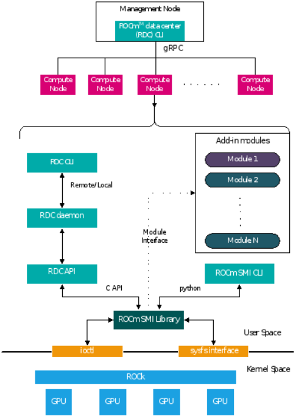

.. meta::
  :description: documentation of the installation, configuration, and use of the ROCm Data Center tool 
  :keywords: ROCm Data Center tool, RDC, ROCm, API, reference, data type, support

.. _rdc-install:

******************************************
Installing and running RDC
******************************************

The ROCm Data Center tool (RDC) is part of the AMD ROCm software and available on the distributions supported by AMD ROCm. For RDC installation from prebuilt packages, follow the instructions in this section.

Prerequisites
=============

The installation dependencies are described in `Dependencies in the README <https://github.com/ROCm/rdc?tab=readme-ov-file#dependencies>`_. To see the list of supported operating systems, refer to `System requirements <https://rocm.docs.amd.com/projects/install-on-linux/en/latest/reference/system-requirements.html>`_.  

Install gRPC
============

To see the instructions for building ``gRPC`` and ``protoc``, refer to `Building gRPC and protoc <https://github.com/ROCm/rdc#building-grpc-and-protoc>`_.

Authentication keys
===================

RDC can be used with or without authentication. If authentication is required you must configure proper authentication keys as described in *Authentication* in :ref:`rdc-handbook`.

Prebuilt packages
=================

RDC is packaged as part of the ROCm software repository. You must install the AMD ROCm software before installing RDC, as described in `ROCm installation <https://rocm.docs.amd.com/projects/install-on-linux/en/latest/>`_.

To install RDC after installing the ROCm package, use the following instructions.

.. tab-set::

    .. tab-item:: Ubuntu
        :sync: ubuntu-tab

        .. code-block:: shell

            $ sudo apt-get install rdc
            # or, to install a specific version
            $ sudo apt-get install rdc<x.y.z>

    .. tab-item:: SLES 15 Service Pack 3
        :sync: sles-tab

        .. code-block:: shell

            $ sudo zypper install rdc
            # or, to install a specific version
            $ sudo zypper install rdc<x.y.z>

Components
==========

The components of the RDC tool are as shown below:

    High-level diagram of RDC components

RDC (API) library
-----------------

This library is the central piece, which interacts with different modules and provides all the features described. This shared library provides C API and Python bindings so that third-party tools should be able to use it directly if required.

RDC daemon (``rdcd``)
---------------------

The ``rdcd`` daemon records telemetry information from GPUs. It also provides an interface to RDC command-line tool (``rdci``) running locally or remotely. It relies on the above RDC Library for all the core features.

RDC command-line tool (``rdci``)
--------------------------------

A command-line tool to invoke all the features of the RDC tool. This CLI can be run locally or remotely.

AMDSMI library
--------------

A stateless system management library that provides low-level interfaces to access GPU information

Starting RDC
============

The RDC tool can be run in the following two modes. The feature set is similar in both the cases. You have the flexibility to choose the option that best fits your environment.

* :ref:`standalone`
* :ref:`embedded`

The capability in each mode depends on the privileges you have for starting the RDC tool. A normal user has access only to monitor (GPU telemetry) capabilities. A privileged user can run the tool with full capability. In the full capability mode, GPU configuration features can be invoked. This may or may not affect all the users and processes sharing the GPU.

.. _`standalone`:

Standalone mode
---------------

This is the preferred mode of operation, as it does not have any external dependencies. To start RDC in standalone mode, RDC Server Daemon (``rdcd``) must run on each compute node. Refer to *Terminology* in :ref:`rdc-use` for more information. You can start ``rdcd`` as a ``systemd`` service or directly from the command-line.

Start the RDC tool using ``systemd``
^^^^^^^^^^^^^^^^^^^^^^^^^^^^^^^^^^^^

If multiple RDC versions are installed, copy `/opt/rocm-<x.y.z>/libexec/rdc/rdc.service`, which is installed with the desired RDC version, to the ``systemd`` folder. The capability of RDC can be configured by modifying the ``rdc.service`` system configuration file. Use the ``systemctl`` command to start ``rdcd``.

.. code-block:: shell
  
    $ systemctl start rdc

By default, ``rdcd`` starts with full capability. To change to monitor only, comment out the following two lines:

.. code-block:: shell
  
    $ sudo vi /lib/systemd/system/rdc.service

    # CapabilityBoundingSet=CAP_DAC_OVERRIDE
    # AmbientCapabilities=CAP_DAC_OVERRIDE

 
.. note::
  ``rdcd`` can be started by using the ``systemctl`` command.

.. code-block:: shell
  
    $ systemctl start rdc

If the GPU reset fails, restart the server. Note that restarting the server also initiates ``rdcd``. You may then encounter the following two scenarios:

* ``rdcd`` returns the correct GPU information to ``rdci``
* ``rdcd`` returns the "No GPUs found on the system" error to ``rdci``. To resolve this error, restart ``rdcd`` with the following instruction: 

.. code-block:: shell
  
    $ sudo systemctl restart rdcd

Start the RDC tool from the command-line
^^^^^^^^^^^^^^^^^^^^^^^^^^^^^^^^^^^^^^^^

While ``systemctl`` is the preferred way to start ``rdcd``, you can also start directly from the command-line. The installation scripts create a default user - ``rdc``. Users have the option to edit the profile file (``rdc.service`` installed at ``/lib/systemd/system``) and change these lines accordingly:

.. code-block:: shell
  
    [Service]
    User=rdc
    Group=rdc

From the command-line, start ``rdcd`` as a user such as ``rdc``, or start it as ``root``:

.. code-block:: shell
  
    #Start as user rdc
    $ sudo -u rdc rdcd
 
    # Start as root
    $ sudo rdcd

In this use case, the ``rdc.service`` file mentioned in the previous section is not involved. Here, the capability of RDC is determined by the privilege of the user starting ``rdcd``. If ``rdcd`` is running under a normal user account it has the monitor-only capability. If ``rdcd`` is running as ``root`` then it has the full capability.

.. note::
  If a user other than ``rdc`` or ``root`` starts the ``rdcd`` daemon, the file ownership of the SSL keys mentioned in the Authentication section must be modified to allow read and write access.

Troubleshoot ``rdcd``
---------------------

When ``rdcd`` is started using ``systemctl``, the logs can be viewed using the following command:

.. code-block:: shell
  
    $ journalctl -u rdc

These messages provide useful status and debugging information. The logs can also help debug problems like ``rdcd`` failing to start, communication issues with a client, and others.

.. _`embedded`:

Embedded mode
-------------

The embedded mode is useful if the end user has a monitoring agent running on the compute node. The monitoring agent can directly use the RDC library and will have a finer-grain control on how and when RDC features are invoked. For example, if the monitoring agent has a facility to synchronize across multiple nodes, it can synchronize GPU telemetry across these nodes.

The RDC daemon ``rdcd`` can be used as a reference code for this purpose. The dependency on ``gRPC`` is also eliminated if the RDC library is directly used.

.. caution::
    RDC command-line ``rdci`` will not function in this mode. Third-party monitoring software is responsible for providing the user interface and remote access/monitoring. 
