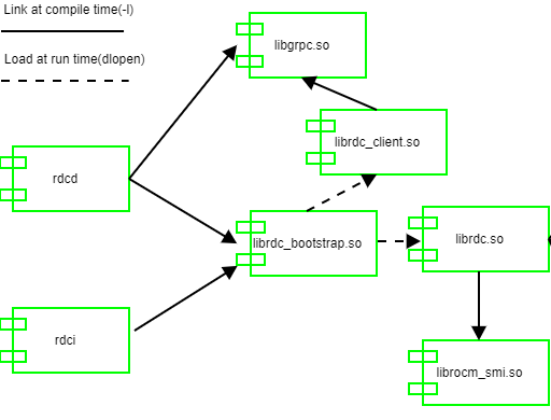

# ROCm Data Center API

Disclaimer: This is the alpha version of RDC API™ and is subject to change without notice. The primary purpose of this API is to solicit feedback. AMD accepts no responsibility for any software breakage caused by API changes.

## RDC API

The RDC tool API is the core library that provides all the RDC features. This section focuses on how RDC API can be used by third-party software.

The RDC includes the following libraries:

•        librdc_bootstrap.so: Loads during runtime one of the two libraries by detecting the mode.

•        librdc_client.so: Exposes RDC functionality using gRPC client.

•        librdc.so: RDC API. This depends on librocm_smi.so.

•        librocm_smi.so: Stateless low overhead access to GPU data.



Different libraries and how they are linked.

Note that librdc_bootstrap.so loads different libraries based on the modes.

Example:

•        rdci: librdc_bootstrap.so loads librdc_client.so

•        rdcd: librdc_bootstrap.so loads librdc.so

For more information, see the ROCm Data Center Tool API Guide at https://docs.amd.com.

## Job Stats Use Case

The following pseudocode shows how RDC tool API can be directly used to record GPU statistics associated with any job or workload. Refer to the example code provided with RDC on how to build it.

For more information, see the [Job Stats section in Features](features.md).

```
//Initialize the RDC
rdc_handle_t rdc_handle;
rdc_status_t result=rdc_init(0);
 
//Dynamically choose to run in standalone or embedded mode
bool standalone = false;
std::cin>> standalone;
if (standalone)
  result = rdc_connect("127.0.0.1:50051", &rdc_handle, nullptr, nullptr, nullptr); //It will connect to the daemon
else
  result = rdc_start_embedded(RDC_OPERATION_MODE_MANUAL, &rdc_handle); //call library directly, here we run embedded in manual mode
 
//Now we can use the same API for both standalone and embedded
//(1) create group
rdc_gpu_group_t groupId;
result = rdc_group_gpu_create(rdc_handle, RDC_GROUP_EMPTY, "MyGroup1", &groupId);
 
//(2) Add the GPUs to the group
result = rdc_group_gpu_add(rdc_handle, groupId, 0); //Add GPU 0
result = rdc_group_gpu_add(rdc_handle, groupId, 1); //Add GPU 1
 
//(3) start the recording the Slurm job 123. Set the sample frequency to once per second
result = rdc_job_start_stats(rdc_handle, group_id,
  "123", 1000000);
 
//For standalone mode, the daemon will update and cache the samples
//In manual mode, we must call rdc_field_update_all periodically to take samples
if (!standalone) { //embedded manual mode
  for (int i=5; i>0; i--) { //As an example, we will take 5 samples
  result = rdc_field_update_all(rdc_handle, 0);
  usleep(1000000);
  }
} else { //standalone mode, do nothing
  usleep(5000000); //sleep 5 seconds before fetch the stats
}
 
//(4) stop the Slurm job 123, which will stop the watch
// Note: we do not have to stop the job to get stats. The rdc_job_get_stats can be called at any time before stop
result = rdc_job_stop_stats(rdc_handle, "123");
 
//(5) Get the stats
rdc_job_info_t job_info;
result = rdc_job_get_stats(rdc_handle, "123", &job_info);
std::cout<<"Average Memory Utilization: " <<job_info.summary.memoryUtilization.average <<std::endl;
 
//The cleanup and shutdown ....
```
