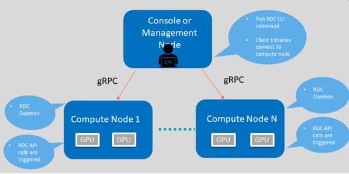
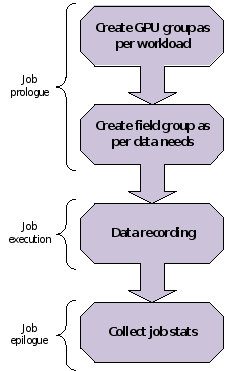

# Data Center Tool: Feature Overview

Note that RDC Tool is in active development. This section highlights the current feature set.



RDC components and framework for describing features

## Discovery

The Discovery feature enables you to locate and display information of GPUs present in the compute node.

Example:

```
$ rdci discovery <host_name> -l
 2 GPUs found
```

| GPU Index | Device Information                          |
| --------- | ------------------------------------------- |
| 0         | Name: AMD Radeon Instinct™ MI50 Accelerator |
| 1         | Name: AMD Radeon Instinct™ MI50 Accelerator |

```
$ rdci -l : list available GPUs
$ rdci -u: No SSL authentication
```

## Groups

This section explains the GPU and field groups features.

### GPU Groups

With the GPU groups feature, you can create, delete, and list logical groups of GPU.

```
$ rdci group -c GPU_GROUP
Successfully created a group with a group ID 1
 
$ rdci group -g 1 -a 0,1
Successfully added the GPU 0,1 to group 1
 
$ rdci group –l
 
1 group found
```

| Group ID | Group Name   | GPU Index |
| -------- | ------------ | --------- |
| 1        | GPU_GROUP    | 0, 1      |

```
$ rdci group -d 1
Successfully removed group 1
 
-c create; –g group id; –a add GPU index; –l list; -d delete group 
```

### Field Groups

The Field Groups feature provides you the options to create, delete, and list field groups.

```
$ rdci fieldgroup -c <fgroup> -f 150,155
Successfully created a field group with a group ID 1
 
$ rdci fieldgroup -l
 
1 group found
```

| Group ID | Group Name   | Field Ids |
| -------- | ------------ | --------- |
| 1        | Fgroup       | 150, 155  |

```
$ rdci fieldgroup -d 1
Successfully removed field group 1
 
rdci dmon –l
Supported fields Ids: 
100 RDC_FI_GPU_CLOCK:  Current GPU clock freq.
150 RDC_FI_GPU_TEMP:  GPU temp. in milli Celsius.
155 RDC_FI_POWER_USAGE:  Power usage in microwatts.
203 RDC_FI_GPU_UTIL:  GPU busy percentage.
525 RDC_FI_GPU_MEMORY_USAGE: VRAM Memory usage in bytes
 
-c create; –g group id; –a add GPU index; –l list; -d delete group
```

### Monitor Errors

You can define RDC_FI_ECC_CORRECT_TOTAL or RDC_FI_ECC_UNCORRECT_TOTAL field to get the RAS Error-Correcting Code (ECC) counter:

•        312 RDC_FI_ECC_CORRECT_TOTAL: Accumulated correctable ECC errors

•        313 RDC_FI_ECC_UNCORRECT_TOTAL: Accumulated uncorrectable ECC errors

## Device Monitoring

The RDC Tool enables you to monitor the GPU fields.

```
$ rdci dmon -f <field_group> -g <gpu_group> -c 5 -d 1000
 
 
1 group found
```

| GPU Index | TEMP (m°C)   | POWER (µW) |
| --------- | ------------ | ---------- |
| 0         | 25000        | 520500     |

```
rdci dmon –l
Supported fields Ids: 
100 RDC_FI_GPU_CLOCK:  Current GPU clock freq.
150 RDC_FI_GPU_TEMP:  GPU temp. in milli Celsius.
155 RDC_FI_POWER_USAGE:  Power usage in microwatts.
203 RDC_FI_GPU_UTIL:  GPU busy percentage.
525 RDC_FI_GPU_MEMORY_USAGE: VRAM Memory usage in bytes
 
-e field ids; -i GPU index; -c count; -d delay; -l list; -f fieldgroup id 
```

## Job Stats

You can display GPU statistics for any given workload.

```
$ rdci stats -s 2 -g 1
Successfully started recording job 2 with a group ID 1
 
$ rdci stats -j 2
```

| Summary                           | Executive Status             |
| --------------------------------- | ---------------------------- |
| Start time                        | 1586795401                   |
| End time                          | 1586795445                   |
| Total execution time              | 44                           |
| --------------------------------- | ---------------------------- |
| Energy Consumed (Joules)          | 21682                        |
| Power Usage (Watts)               | Max: 49 Min: 13 Avg: 34      |
| GPU Clock (MHz)                   | Max: 1000 Min: 300 Avg: 903  |
| GPU Utilization (%)               | Max: 69 Min: 0 Avg: 2        |
| Max GPU Memory Used (bytes)       | 524320768                    |
| Memory Utilization (%)            | Max: 12 Min: 11 Avg: 12      |

```
$ rdci stats -x 2
Successfully stopped recording job 2
 
-s start recording on job id; -g group id; -j display job stats; –x stop recording. 
```

## Job Stats Use Case

A common use case is to record GPU statistics associated with any job or workload. The following example shows how all these features can be put together for this use case:



An example showing how job statistics can be recorded

rdci commands

```
$ rdci group -c group1

successfully created a group with a group ID 1

$ rdci group -g 1 -a 0,1

GPU 0,1 is added to group 1 successfully.

rdci stats -s 123 -g 1

job 123 recorded successfully with the group ID 

rdci stats -x 123

job 123 stops recording successfully 

rdci stats -j 123

job stats printed 
```

## Error-Correcting Code Output

In the job output, this feature prints out the Error-Correcting Code (ECC) errors while running the job.

## Diagnostic

You can run diagnostic on a GPU group as shown below:

```
$ rdci diag -g <gpu_group>
 
No compute process:  Pass
Node topology check:  Pass
GPU parameters check:  Pass
Compute Queue ready:  Pass
System memory check:  Pass
 =============== Diagnostic Details ==================
No compute process:  No processes running on any devices.
Node topology check:  No link detected.
GPU parameters check:  GPU 0 Critical Edge temperature in range.
Compute Queue ready:  Run binary search task on GPU 0 Pass.
System memory check:  Max Single Allocation Memory Test for GPU 0 Pass. CPUAccessToGPUMemoryTest for GPU 0 Pass. GPUAccessToCPUMemoryTest for GPU 0 Pass. 
```
