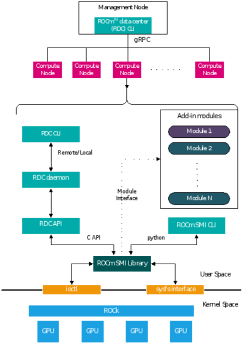

# Data Center Tool: Installation and Integration

## Supported Platforms

The RDC tool is part of the AMD ROCm software and available on the distributions supported by AMD ROCm.

To see the list of supported operating systems, refer to the ROCm installation guide at https://docs.amd.com.  

## Prerequisites

For RDC installation from prebuilt packages, follow the instructions in this section.

The list of dependencies can be found on the [README.md on GitHub](https://github.com/RadeonOpenCompute/rdc#dependencies).

## Install gRPC

To see the instructions for building gRPC and protoc, refer to the [README.md on GitHub](https://github.com/RadeonOpenCompute/rdc#building-grpc-and-protoc).

### Authentication Keys

The RDC tool can be used with or without authentication. If authentication is required, you must configure proper authentication keys.

For configuring SSL keys, refer to the section on Authentication below.

## Prebuilt Packages

The RDC tool is packaged as part of the ROCm software repository. You must install the AMD ROCm software before installing RDC. For details on ROCm installation, see the AMD ROCm Installation Guide.

To install RDC after installing the ROCm package, follow the instructions below.

### Ubuntu

```
$ sudo apt-get install rdc
# to install a specific version
$ sudo apt-get install rdc<x.y.z>
SLES 15 Service Pack 3
$ sudo zypper install rdc
# to install a specific version
$ sudo zypper install rdc<x.y.z>
```

### SLES 15 Service Pack 3

```
$ sudo zypper install rdc
# to install a specific version
$ sudo zypper install rdc<x.y.z>
```

## Components

The components of RDC tool are as shown below:



High-level diagram of RDC components.

RDC (API) Library

This library is the central piece, which interacts with different modules and provides all the features described. This shared library provides C API and Python bindings so that third-party tools should be able to use it directly if required.

RDC Daemon (rdcd)

The daemon records telemetry information from GPUs. It also provides an interface to RDC command-line tool (rdci) running locally or remotely. It relies on the above RDC Library for all the core features.

RDC Command Line Tool (rdci)

A command-line tool to invoke all the features of the RDC tool. This CLI can be run locally or remotely.

ROCm-SMI Library

A stateless system management library that provides low-level interfaces to access GPU information

## Start RDC

The RDC tool can be run in the following two modes. The feature set is similar in both the cases. Users have the flexibility to choose the right option that best fits their environment.

•        Standalone mode

•        Embedded mode

The capability in each mode depends on the privileges the user has for starting RDC. A normal user has access only to monitor (access to GPU telemetry) capabilities. A privileged user can run the tool with full capability. In the full capability mode, GPU configuration features can be invoked. This may or may not affect all the users and processes sharing the GPU.

### Standalone Mode

This is the preferred mode of operation, as it does not have any external dependencies. To start RDC in standalone mode, RDC Server Daemon (rdcd) must run on each compute node. You can start RDC daemon (rdcd) as a systemd service or directly from the command-line.

#### Start RDC Tool Using systemd

If multiple RDC versions are installed, copy `/opt/rocm-<x.y.z>/rdc/lib/rdc.service`, which is installed with the desired RDC version, to the systemd folder. The capability of RDC can be configured by modifying the rdc.service system configuration file. Use the systemctl command to start rdcd.

```
$ systemctl start rdc
```

By default, rdcd starts with full capability. To change to monitor only, comment out the following two lines:

```
$ sudo vi /lib/systemd/system/rdc.service
# CapabilityBoundingSet=CAP_DAC_OVERRIDE
# AmbientCapabilities=CAP_DAC_OVERRIDE
```
 
NOTE: rdcd can be started by using the systemctl command.

```
$ systemctl start rdc
```

If the GPU reset fails, restart the server. Note that restarting the server also initiates rdcd. Users may then encounter the following two scenarios:

•        rdcd returns the correct GPU information to rdci. 

•        rdcd returns the "No GPUs found on the system" error to rdci. To resolve this error, restart rdcd with the following instruction: 

```
  sudo systemctl restart rdcd
```

### Start RDC Tool from Command-line

While systemctl is the preferred way to start rdcd, you can also start directly from the command-line. The installation scripts create a default user - “rdc”. Users have the option to edit the profile file (rdc.service installed at /lib/systemd/system) and change these lines accordingly:

```
[Service]
User=rdc
Group=rdc
```
 
```
#Start as user rdc
$ sudo -u rdc rdcd
 
# Start as root
$ sudo rdcd
```

From the command-line, start rdcd as a user (for example, rdc) or root.

Note that in this use case, the rdc.service file mentioned in the previous section is not involved. Here, the capability of RDC is determined by the privilege of the user starting rdcd. If rdcd is running under a normal user account, it has the Monitor-only capability. If rdcd is running as root, rdcd has full capability.

NOTE: If a user other than rdc or root starts the rdcd daemon, the file ownership of the SSL keys mentioned in the Authentication section must be modified to allow read and write access.

### Troubleshoot rdcd

When rdcd is started using systemctl, the logs can be viewed using the following command:

```
$ journalctl -u rdc
```

These messages provide useful status and debugging information. The logs can also help debug problems like rdcd failing to start, communication issues with a client, and others.

## Embedded Mode

The embedded mode is useful if the end user has a monitoring agent running on the compute node. The monitoring agent can directly use the RDC library and will have a finer-grain control on how and when RDC features are invoked. For example, if the monitoring agent has a facility to synchronize across multiple nodes, it can synchronize GPU telemetry across these nodes.

The RDC daemon rdcd can be used as a reference code for this purpose. The dependency on gRPC is also eliminated if the RDC library is directly used.

CAUTION: RDC command-line rdci will not function in this mode. Third-party monitoring software is responsible for providing the user interface and remote access/monitoring. 
