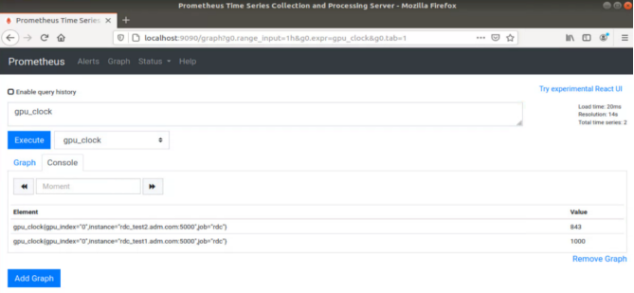
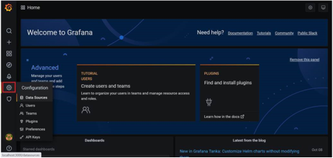
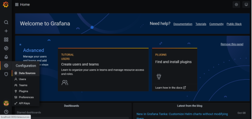
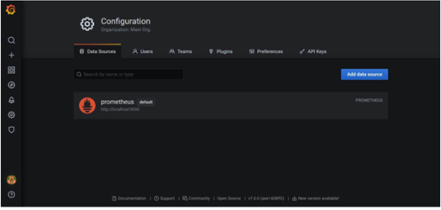
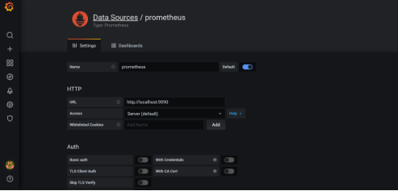
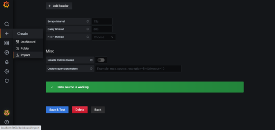
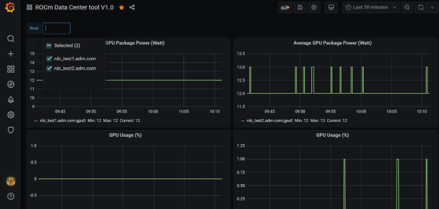

# Data Center Tool: Third-Party Integration

This section lists all the third-party plugins such as Prometheus, Grafana, and Reliability, Availability and Serviceability (RAS) plugin.

## Python Bindings

The RDC Tool provides a generic Python class RdcReader to simplify telemetry gathering. RdcReader simplifies usage by providing the following functionalities:

•        The user only needs to specify telemetry fields. RdcReader creates the necessary groups and fieldgroups, watch the fields, and fetch the fields.

•        The RdcReader can support embedded and standalone mode. The standalone mode can be with or without authentication.

•        In standalone mode, the RdcReader can automatically reconnect to rdcd if the connection is lost.

•        When rdcd is restarted, the previously created group and fieldgroup may be lost. The RdcReader can re-create them and watch the fields after reconnecting.

•        If the client is restarted, RdcReader can detect the groups and fieldgroups created before and avoid re-creating them.

•        A custom unit converter can be passed to RdcReader to override the default RDC unit.

See the sample program to monitor the power and GPU utilization using the RdcReader below:

```
from RdcReader import RdcReader
from RdcUtil import RdcUtil
from rdc_bootstrap import *
 
default_field_ids = [
        rdc_field_t.RDC_FI_POWER_USAGE,
        rdc_field_t.RDC_FI_GPU_UTIL
]
 
class SimpleRdcReader(RdcReader):
    def __init__(self):
        RdcReader.__init__(self,ip_port=None, field_ids = default_field_ids, update_freq=1000000)
    def handle_field(self, gpu_index, value):
        field_name = self.rdc_util.field_id_string(value.field_id).lower()
        print("%d %d:%s %d" % (value.ts, gpu_index, field_name, value.value.l_int))
 
if __name__ == '__main__':
    reader = SimpleRdcReader()
while True:
      time.sleep(1)
        reader.process()
```

In the sample program,

•        Class SimpleRdcReader is derived from the RdcReader.

•        The field "ip_port=None" in RdcReader dictates that the RDC tool runs in the embedded mode.

•        SimpleRdcReader::process(), then, fetches fields specified in default_field_ids. RdcReader.py can be found in the python_binding folder located at RDC install path.

To run the example, use:

```
# Ensure that RDC shared libraries are in the library path and
# RdcReader.py is in PYTHONPATH
 
$ python SimpleReader.py
```

## Prometheus Plugin

Prometheus plugin helps to monitor events and send alerts. The Prometheus installation and integration details are given below.

### Prometheus Plugin Installation

The RDC tool’s Prometheus plugin rdc_prometheus.py can be found in the python_binding folder.

NOTE: Ensure the Prometheus client is installed before the Prometheus plugin installation process.

```
$ pip install prometheus_client
```

To view the options provided with the plugin, use --help.

```
% python rdc_prometheus.py –help
usage: rdc_prometheus.py [-h] [--listen_port LISTEN_PORT] [--rdc_embedded]
  [--rdc_ip_port RDC_IP_PORT] [--rdc_unauth]
  [--rdc_update_freq RDC_UPDATE_FREQ]
  [--rdc_max_keep_age RDC_MAX_KEEP_AGE]
  [--rdc_max_keep_samples RDC_MAX_KEEP_SAMPLES]
  [--rdc_fields RDC_FIELDS [RDC_FIELDS ...]]
  [--rdc_fields_file RDC_FIELDS_FILE]
  [--rdc_gpu_indexes RDC_GPU_INDEXES [RDC_GPU_INDEXES ...]]
  [--enable_plugin_monitoring]
 
RDC Prometheus plugin.
 
optional arguments:
  -h, --help  show this help message and exit
  --listen_port LISTEN_PORT
  The listen port of the plugin (default: 5000)
  --rdc_embedded  Run RDC in embedded mode (default: standalone mode)
  --rdc_ip_port RDC_IP_PORT
  The rdcd IP and port in standalone mode (default:
  localhost:50051)
  --rdc_unauth  Set this option if the rdcd is running with unauth in
  standalone mode (default: false)
  --rdc_update_freq RDC_UPDATE_FREQ
  The fields update frequency in seconds (default: 10))
  --rdc_max_keep_age RDC_MAX_KEEP_AGE
  The max keep age of the fields in seconds (default:
  3600)
  --rdc_max_keep_samples RDC_MAX_KEEP_SAMPLES
  The max samples to keep for each field in the cache
  (default: 1000)
  --rdc_fields RDC_FIELDS [RDC_FIELDS ...]
  The list of fields name needs to be watched, for
  example, " --rdc_fields RDC_FI_GPU_TEMP
  RDC_FI_POWER_USAGE " (default: fields in the
  plugin)
  --rdc_fields_file RDC_FIELDS_FILE
  The list of fields name can also be read from a file
  with each field name in a separated line (default:
  None)
  --rdc_gpu_indexes RDC_GPU_INDEXES [RDC_GPU_INDEXES ...]
  The list of GPUs to be watched (default: All GPUs)
  --enable_plugin_monitoring
  Set this option to collect process metrics of
  the plugin itself (default: false)
```

By default, the plugin runs in the standalone mode and connects to rdcd at localhost:50051 to fetch fields. The plugin should use the same authentication mode as rdcd, e.g., if rdcd is running with -u/--unauth flag, the plugin should use --rdc_unauth flag. You can use the plugin in the embedded mode without rdcd by setting --rdc_embedded flag.

To override the default fields that are monitored, you can use the --rdc_fields option to specify the list of fields. If the fields list is long, the --rdc_fields_file option provides a convenient way to fetch fields list from a file. You can use the max_keep_age and max_keep_samples to control how the fields are cached.

The plugin can provide the metrics of the plugin itself, including the plugin process CPU, memory, file descriptor usage, and native threads count, including the process start and up times. You can enable this using --enable_plugin_monitoring.

You can test the plugin with the default settings.

```
# Ensure that rdcd is running on the same machine
$ python rdc_prometheus.py
 
# Check the plugin using curl
$ curl localhost:5000
# HELP gpu_util gpu_util
# TYPE gpu_util gauge
gpu_util{gpu_index="0"} 0.0
# HELP gpu_clock gpu_clock
# TYPE gpu_clock gauge
gpu_clock{gpu_index="0"} 300.0
# HELP gpu_memory_total gpu_memory_total
# TYPE gpu_memory_total gauge
gpu_memory_total{gpu_index="0"} 4294.0
# HELP gpu_temp gpu_temp
# TYPE gpu_temp gauge
# HELP power_usage power_usage
# TYPE power_usage gauge
power_usage{gpu_index="0"} 9.0
# HELP gpu_memory_usage gpu_memory_usage
# TYPE gpu_memory_usage gauge
gpu_memory_usage{gpu_index="0"} 134.0
```

## Prometheus Integration

Follow these steps:

1.    [Download and install Prometheus](https://github.com/prometheus/prometheus) in the management machine.

2.    Use the example configuration file rdc_prometheus_example.yml in the python_binding folder. You can use this file in its original state. However, note that this file refers to prometheus_targets.json. Ensure that this is modified to point to the correct compute nodes.

```
// Sample file: prometheus_targets.json
// Replace rdc_test*.amd.com to point the correct compute nodes
// Add as many compute nodes as necessary
[
  {
  "targets": [
  "rdc_test1.amd.com:5000",
  "rdc_test2.amd.com:5000"
  ]
  }
]
```

NOTE: In the above example, there are two compute nodes, rdc_test1.adm.com and rdc_test2.adm.com. Ensure that the Prometheus plugin is running on those compute nodes.

3.    Start the Prometheus plugin.

```
% prometheus --config.file=<full path of the rdc_prometheus_example.yml> 
```

4.    From the management node, using a browser, open the URL http://localhost:9090.

5.    Select one of the available metrics.

Example: gpu_clock



The Prometheus image showing the GPU clock for both rdc_test1 and rdc_test2.

## Grafana Plugin

Grafana is a common monitoring stack used for storing and visualizing time series data. Prometheus acts as the storage backend, and Grafana is used as the interface for analysis and visualization. Grafana has a plethora of visualization options and can be integrated with Prometheus for the RDC tool’s dashboard.

### Grafana Plugin Installation

To install Grafana plugin, follow these steps:

1.     [Download Grafana](https://grafana.com/grafana/download)

2.     Read the [installation instructions](https://grafana.com/docs/grafana/latest/setup-grafana/installation/debian/) to install Grafana

3.     To start Grafana, follow these instructions:

```
sudo systemctl start grafana-server
sudo systemctl status grafana-server
```

4.     Browse to http://localhost:3000/. 

5.     Log in using the default username and password (admin/admin) as shown in the image below: 


### Grafana Integration

As a prerequisite, ensure:

•        The RDC Prometheus plugin is running in each compute node.

•        Prometheus is set up to collect metrics from the plugin.

For more information about installing and configuring Prometheus, see the section on [Prometheus Plugin](https://docs.amd.com/bundle/ROCm-DataCenter-Tool-User-Guide-v5.3/page/Data_Center_Tool_Third-Party_Integration.html#_Prometheus_Plugin).

### Grafana Configuration

Follow these steps:

1.     Click Configuration.



2.     Select Data Sources, as shown in the image below:



3.     Click Add data source.



4.     Select Prometheus.



NOTE: Ensure the name of the data source is "Prometheus." If Prometheus and Grafana are running on the same machine, use the default URL http://localhost:9090. Otherwise, ensure the URL matches the Prometheus URL, save, and test it.



5.     To import the RDC tool dashboard, click “+” and select Import.

6.     Click the Upload.json file.

7.     Choose rdc_grafana_dashboard_example.json, which is in the python_binding folder.

8.     Import the rdc_grafana_dashboard_example.json file, and select the desired compute node on the dashboard, as shown in the image below:



## Prometheus (Grafana) Integration with Automatic Node Detection

The RDC tool enables you to use Consul to discover the rdc_prometheus service automatically. Consul is “a service mesh solution providing a fully featured control plane with service discovery, configuration, and segmentation functionality.” For more information, refer to [Consul](https://developer.hashicorp.com/consul/docs/intro).

The RDC tool uses Consul for health checks of RDC’s integration with the Prometheus plug-in (rdc_prometheus), and these checks provide information on its efficiency.  

Previously, when a new compute node was added, users had to manually change prometheus_targets.json to use Consul. Now, with the Consul agent integration, a new compute node can be discovered automatically.

### Installing the Consul Agent for Compute and Management Nodes

To install the latest Consul agent for compute and management nodes, follow the instructions below:

1.     Set up the apt repository to download and install the Consul agent. 

```
curl -fsSL https://apt.releases.hashicorp.com/gpg | sudo apt-key add -
sudo apt-add-repository "deb [arch=amd64]   https://apt.releases.hashicorp.com $(lsb_release -cs) main"
sudo apt-get update && sudo apt-get install consul
```

2.     Generate a key to encrypt the communication between consul agents. Note that you can generate the key once, and both the compute and management nodes use the same key for communication.
 
```
$ consul keygen
```

For the purposes of this feature documentation, the following key is used in the configuration file:

```
$ consul keygen
4lgGQXr3/R2QeTi5vEp7q5Xs1KoYBhCsk9+VgJZZHAo=
```
 
### Setting up the Consul Server in Management Nodes

While Consul can function with one server, it is recommended to use three to five servers to avoid failure scenarios, which often lead to data loss.

NOTE: For example purposes, the configuration settings documented below are for a single server.

Follow these steps:

1.     Create a configuration file /etc/consul.d/server.hcl. 

```
server = true
encrypt = "<CONSUL_ENCRYPTION_KEY>"
bootstrap_expect = 1
ui = true
client_addr = "0.0.0.0"
bind_addr = "<The IP address can be reached by client>"
```

2.     Run the agent in server mode, and set the encrypt to the key generated in the first step. The bootstrap_expect variable indicates the number of servers required to form the first Consul cluster.

3.     Set the number of servers to 1 to allow a cluster with a single server.  

•       The User Interface (UI) variable is used to enable the Consul Web UI. 

•       The client_addr variable is used to connect the API and UI.

•       The bind_addr variable is used to connect the client to the server. If you have multiple private IP addresses, use the address that can connect to a client.

 4.     Start the agent using the following instruction: 

```
sudo consul agent -config-dir=/etc/consul.d/
```

5.     Browse to http://localhost:8500/ on the management node. You will see a single instance running. 

### Setting up the Consul Client in Compute Nodes

Follow these steps:

1.     Create a configuration file /etc/consul.d/client.hcl.

```
server = false
encrypt = "<CONSUL_ENCRYPTION_KEY>"
retry_join = ["<The consul server address>"]
client_addr = "0.0.0.0"
bind_addr = "<The IP address can reach server>"
```
 
NOTE: Use the same CONSUL_ENCRYPTION_KEY as the servers. In the retry_join, use the IP address of the management nodes.

2.   Start the Consul agent.

```
sudo consul agent -config-dir=/etc/consul.d/
```

The client has now joined the Consul.

```
$ consul members
Node              Address           Status  Type    Build  Protocol  DC   Segment
management-node   10.4.22.70:8301   alive   server  1.9.3  2    dc1  <all>
compute-node      10.4.22.112:8301  alive   client  1.9.3  2    dc1  <default>
```

3.     Set up the Consul client to monitor the health of the RDC Prometheus plugin.

4.     Start the RDC Prometheus plugin.

```
python rdc_prometheus.py --rdc_embedded
```

5.     Add the configuration file /etc/consul.d/rdc_prometheus.hcl.

```
{
  "service": {
    "name": "rdc_prometheus",
    "tags": [
      "rdc_prometheus",
      "rdc"
    ],
    "port": 5000,
    "check": {
      "id": "rdc_plugin",
      "name": "RDC Prometheus plugin on port 5000",
      "http": "http://localhost:5000",
      "method": "GET",
      "interval": "15s",
      "timeout": "1s"
    }
  }
}
```
 
NOTE: By default, the Prometheus plugin uses port 5000. If you do not use the default setting, ensure you change the configuration file accordingly.

After the configuration file is changed, restart the Consul client agent.

```
sudo consul agent -config-dir=/etc/consul.d/
```

6.     Enable the Prometheus integration in the Management node. For more information, refer to the Prometheus Integration section above.

7.     In the Management node, inspect the service.

```
$ consul catalog nodes -service=rdc_prometheus
 
Node              ID        Address      DC
compute-node      76694ab1  10.4.22.112  dc1
```

8.     Create a new Prometheus configuration rdc_prometheus_consul.yml file for the Consul integration.

```
global:
  scrape_interval:     15s # Set the scrape interval to every 15 seconds. Default is every 1 minute.
  evaluation_interval: 15s # Evaluate rules every 15 seconds. The default is every 1 minute. 
scrape_configs:
  - job_name: 'consul'
    consul_sd_configs:
      - server: 'localhost:8500'
    relabel_configs:
      - source_labels: [__meta_consul_tags]
        regex: .*,rdc,.*
        action: keep
      - source_labels: [__meta_consul_service]
        target_label: job
```
 
NOTE: If you are not running the consul server and Prometheus in the same machine, change the server under consul_sd_configs to your consul server address.

9.     Start Prometheus.

```
$ ./prometheus --config.file="rdc_prometheus_consul.yml"
```

10.  Browse the Prometheus UI at http://localhost:9090 on the Management node and query RDC Prometheus metrics. Ensure that the plugin starts before running the query.

## Reliability, Availability, and Serviceability Plugin

The RAS plugin helps to gather and count errors. The details of RAS integration with RDC are given below.

### RAS Plugin Installation

In this release, the RDC tool extends support to the Reliability, Availability, and Serviceability (RAS) integration. When the RAS feature is enabled in the graphic card, users can use RDC to monitor RAS errors.

#### Prerequisite

You must ensure the graphic card supports RAS.

NOTE: The RAS library is installed as part of the RDC installation, and no additional configuration is required for RDC.

The RDC tool installation dynamically loads the RAS library librdc_ras.so. The configuration files required by the RAS library are installed in the sp3 and config folders.

```
% ls /opt/rocm-4.2.0/rdc/lib
... librdc_ras.so ...
... sp3 ... config ...
```
 
### RAS Integration

RAS exposes a list of Error-Correcting Code (ECC) correctable and uncorrectable errors for different IP blocks and enables users to successfully troubleshoot issues.

For example, the dmon command passes the ECC_CORRECT and ECC_UNCORRECT counters field id to the command.

```
rdci dmon -i 0 -e 600,601
```

The dmon command monitors GPU index 0, field 600, and 601, where 600 is for the ECC_CORRECT counter and 601 is for the ECC_UNCORRECT counter.

```
% rdci dmon -l
... ...
600 RDC_FI_ECC_CORRECT_TOTAL : Accumulated Single Error Correction.
601 RDC_FI_ECC_UNCORRECT_TOTAL : Accumulated Double Error Detection.
602 RDC_FI_ECC_SDMA_SEC : SDMA Single Error Correction.
603 RDC_FI_ECC_SDMA_DED : SDMA Double Error Detection.
604 RDC_FI_ECC_GFX_SEC : GFX Single Error Correction.
605 RDC_FI_ECC_GFX_DED : GFX Double Error Detection.
606 RDC_FI_ECC_MMHUB_SEC : MMHUB Single Error Correction.
607 RDC_FI_ECC_MMHUB_DED : MMHUB Double Error Detection.
608 RDC_FI_ECC_ATHUB_SEC : ATHUB Single Error Correction.
609 RDC_FI_ECC_ATHUB_DED : ATHUB Double Error Detection.
610 RDC_FI_ECC_BIF_SEC : BIF Single Error Correction.
611 RDC_FI_ECC_BIF_DED : BIF Double Error Detection.
612 RDC_FI_ECC_HDP_SEC : HDP Single Error Correction.
613 RDC_FI_ECC_HDP_DED : HDP Double Error Detection.
614 RDC_FI_ECC_XGMI_WAFL_SEC : XGMI WAFL Single Error Correction.
615 RDC_FI_ECC_XGMI_WAFL_DED : XGMI WAFL Double Error Detection.
616 RDC_FI_ECC_DF_SEC : DF Single Error Correction.
617 RDC_FI_ECC_DF_DED : DF Double Error Detection.
618 RDC_FI_ECC_SMN_SEC : SMN Single Error Correction.
619 RDC_FI_ECC_SMN_DED : SMN Double Error Detection.
620 RDC_FI_ECC_SEM_SEC : SEM Single Error Correction.
621 RDC_FI_ECC_SEM_DED : SEM Double Error Detection.
622 RDC_FI_ECC_MP0_SEC : MP0 Single Error Correction.
623 RDC_FI_ECC_MP0_DED : MP0 Double Error Detection.
624 RDC_FI_ECC_MP1_SEC : MP1 Single Error Correction.
 
625 RDC_FI_ECC_MP1_DED : MP1 Double Error Detection.
626 RDC_FI_ECC_FUSE_SEC : FUSE Single Error Correction.
627 RDC_FI_ECC_FUSE_DED : FUSE Double Error Detection.
628 RDC_FI_ECC_UMC_SEC : UMC Single Error Correction.
629 RDC_FI_ECC_UMC_DED : UMC Double Error Detection.
... ...
```

To access the ECC correctable and uncorrectable error counters, use the following command:

```
% rdci dmon -i 0 -e 600,601
GPU     ECC_CORRECT         ECC_UNCORRECT
0       0                   0
0       0                   0
0       0                   0
```
